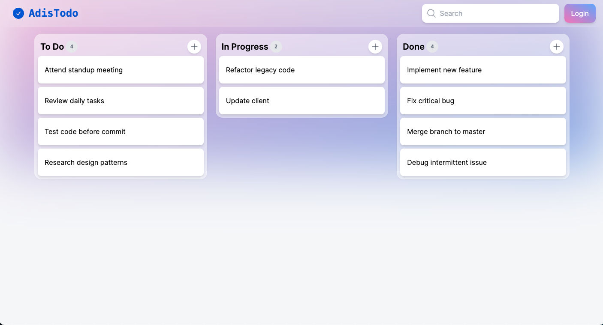

# Kanban Todo Board

This is a simple todo list app built using nextjs and appwrite.
It allows you to create, edit, delete and move tasks between different columns.



_The main features of this app is the drag and drop functionality which allows user to easy move tasks between different columns._

## Technologies Used

- TypeScript
- Next.js
- Appwrite
- Drag and Drop (@hello-pangea/dnd)
- Headless UI

## Getting Started

These instructions will get you a copy of the project up and running on your local machine for development and testing purposes.

### Prerequisites

- Node.js
- npm

### Installation

1. Clone the repo
   ```sh
   git clone https://github.com/AdithyanA2005/TodoList_Kanban_Board_NextJs
   ```
2. Install NPM packages
   ```sh
    npm install
   ```

### Usage

1. Set up env.local file
   ```sh
    NEXT_PUBLIC_AW_ENDPOINT=<string>
    NEXT_PUBLIC_AW_PROJECT_ID=<string>
    NEXT_PUBLIC_AW_DATABASE_ID=<string>
    NEXT_PUBLIC_AW_IMAGE_STORAGE_ID=<string>
    NEXT_PUBLIC_AW_TODOS_COLLECTION_ID=<string>
    NEXT_PUBLIC_SECRET_KEY=<string - any set of characters>
   ```

2. Run the development server
   ```sh
   npm run dev
   ```

3. Open [http://localhost:3000](http://localhost:3000) to view it in the browser.

## Contact

Devloper: Adithyan A [@linkedin](www.linkedin.com/in/iadithyana)

Deployed Project Link: [https://adistodo.vercel.app/](https://adistodo.vercel.app/)
